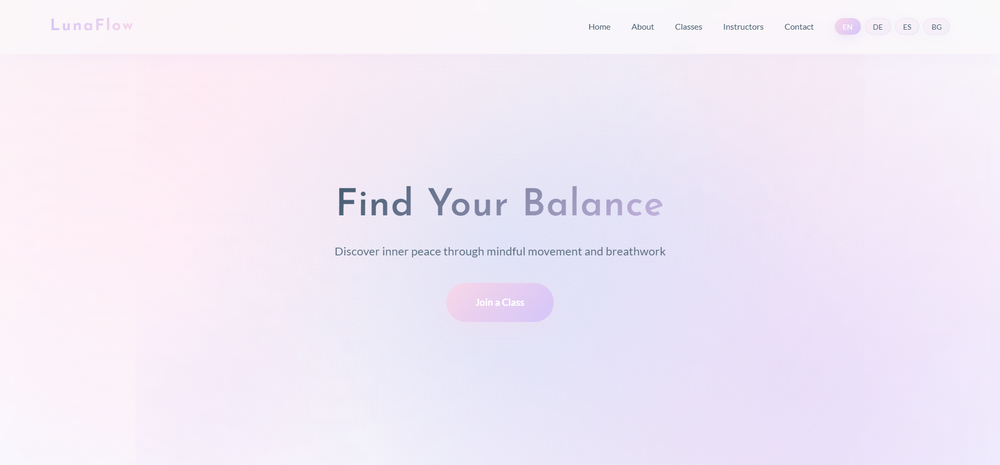

# LunaFlow Studio - Yoga & Pilates Website



## 🌸 Live Demo
**[Visit LunaFlow Studio](https://lunaflow-pilates-yoga.vercel.app/)**

## ✨ Overview
A premium single-page yoga and pilates studio website featuring elegant design, smooth animations, and multilingual support. Built with pure HTML, CSS, and vanilla JavaScript for optimal performance.

## 🎨 Features
- **6 Class Types**: Yoga, Pilates, Mindfulness, Workshops, Yin Yoga, Barre Fusion
- **Multilingual**: EN, DE, ES, BG language support
- **Responsive Design**: Perfect on all devices
- **Smooth Animations**: Ultra-polished transitions and micro-interactions
- **Real Images**: Professional photography integration
- **Custom SVG Icons**: Unique illustrations for each class
- **Contact Form**: Booking system with validation
- **Auto-rotating Testimonials**: Engaging social proof
- **Scroll Effects**: Parallax and fade-in animations

## 🛠️ Technologies
- HTML5
- CSS3 (Flexbox, Grid, Custom Properties, Animations)
- Vanilla JavaScript (ES6+)
- Google Fonts (Josefin Sans, Lato)

## 📱 Responsive Breakpoints
- Desktop: 1400px+
- Tablet: 968px - 1399px
- Mobile: 600px - 967px
- Small Mobile: < 600px

## 🌍 Multilingual Support
Complete translations for:
- English (EN)
- German (DE)
- Spanish (ES)
- Bulgarian (BG)

## 🎯 Performance
- Preloaded critical resources
- Optimized animations with `will-change`
- Lazy loading ready
- No external dependencies
- Single file deployment

## 📸 Screenshots

<div align="center">
  <a href="screenshots">
    
  </a>
</div>

## 🚀 Quick Start

1. Clone the repository:
```bash
git clone https://github.com/Rado4200/lunaflow-pilates-yoga.git
```

2. Open `index.html` in your browser - that's it! No build process needed.

## 📄 License
This project is open source and available under the MIT License.

## 👤 Author
**Radoslav Tsvetanov**
- GitHub: [@Rado4200](https://github.com/Rado4200)

---

<div align="center">
  <p>Made with 💜 for wellness and mindfulness</p>
</div>
